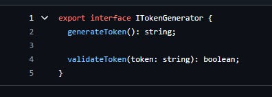

# 3.1. Módulo Padrões de Projeto GoFs Criacionais

<!-- Foco_01: Padrões de Projeto GoFs Criacionais

Entrega Mínima: 1 Padrão GoF Criacional, com nível de modelagem e nível de implementação evidenciados (ou seja, código rodando e hospedado no repositório do projeto).

Apresentação (em sala) explicando o GoF Criacional, com: (i) rastro claro aos membros participantes (MOSTRAR QUADRO DE PARTICIPAÇÕES & COMMITS); (ii) justificativas & senso crítico sobre o padrão GOF criacional, e (iii) comentários gerais sobre o trabalho em equipe. Tempo da Apresentação: +/- 5min. Recomendação: Apresentar diretamente via Wiki ou GitPages do Projeto. Baixar os conteúdos com antecedência, evitando problemas de internet no momento de exposição nas Dinâmicas de Avaliação.

A Wiki ou GitPages do Projeto deve conter um tópico dedicado ao Módulo Padrões de Projeto GoFs Criacionais, com 1 padrão GoF Criacional (modelagem & implementação), histórico de versões, referências, e demais detalhamentos gerados pela equipe nesse escopo.

Demais orientações disponíveis nas Diretrizes (vide Moodle). -->

# Factory Method

O padrão de projeto Factory Method foi utilizado para encapsular a lógica de criação de um objeto User com base nos dados recebidos no CreateUserDto. Esse padrão é útil porque centraliza a criação de objetos, promovendo reuso, padronização e organização do código.

A seguir tem a imagens da implementação:

<center>

  
  
</center>

<figcaption align='center'>
    <h6><b>Figura 1: Classe UserFactory. Autor(es): Gabriel Marcolino e Shaíne Oliveira</h6></b>
</figcaption>

 Lógica de criação de um token com base no tipo de criptografia. Esse padrão é útil porque centraliza a criação de objetos, promovendo reuso, padronização e organização do código.

A seguir tem a imagens da implementação:

<center>

  
  
</center>

<figcaption align='center'>
    <h6><b>Figura 2: Classe UserFactory. Autor(es): Caio Berg</h6></b>
</figcaption>

# Builder

O padrão **Builder** permite a construção de objetos complexos passo a passo. Ele foi utilizado no método `updateUser` para construir o objeto `UpdateUserDto` e no `deleteUser` para construir a resposta da requisição.

## Rastreabilidade e Elos com Outros Artefatos

- **Camada de Serviço**: Usa o objeto configurado pelo Builder para a lógica de negócio.
- **Camada de Repositório**: Recebe o objeto `UpdateUserDto` construído pelo Builder para enviar ao banco.

## Implementação

### Classe Builder:

```typescript
export class UserResponseDtoBuilder {
  private data: UserResponseDto;
  
  constructor() {
    this.data = new UserResponseDto();
  }

  setName(name: string): UserResponseDtoBuilder {
    this.data.name = name;
    return this;
  }

  setCpfCnpj(cpf_cnpj: string): UserResponseDtoBuilder {
    this.data.cpf_cnpj = cpf_cnpj;
    return this;
  }

  setEmail(email: string): UserResponseDtoBuilder {
    this.data.email = email;
    return this;
  }

  setSite(site: string): UserResponseDtoBuilder {
    this.data.site = site;
    return this;
  }

  build(): UserResponseDto {
    return this.data;
  }
}
```

### Uso no Método `updateUser`:

```typescript
const builder = new UpdateUserBuilder();
const userResponse = builder
  .setName(data.name)
  .setCpfCnpj(data.cpf_cnpj)
  .setEmail(data.email)
  .setSite(data.site)
  .build();
```

### Uso no Método `deleteUser`:
```typescript
    const builder = new UserResponseDtoBuilder();
    const userResponse = builder
      .setName(deletedUser.name)
      .setCpfCnpj(deletedUser.cpf_cnpj)
      .setEmail(deletedUser.email)
      .setSite(deletedUser.site)
      .build();
```

## Senso Crítico

### Por que Builder?

- Evita que a lógica de configuração de objetos fique espalhada no código.

### Pontos Positivos:

- Facilita a adição de novos campos sem alterar o método principal.

### Limitações:

- Requer mais esforço inicial para configurar o Builder.

# Singleton

O padrão **Singleton** foi utilizado para garantir que apenas uma instância da classe `ApiService` seja criada e compartilhada entre os componentes que a utilizam. Isso é util para padronizar o acesso a recursos compartilhados e evitar problemas de concorrência.

## Implementação 1

## Rastreabilidade e Elos com Outros Artefatos

- **Camada de Serviço**: Usa a instância única de `ApiService` para fazer requisições HTTP.
- **Camada de Repositório**: Recebe os dados obtidos pela `ApiService` para persistir no banco.


### Classe Singleton:

```typescript
export class ApiService {
  constructor(private http: HttpClient) {}

  httpOptions(contentType = 'application/json', hasContentType = true): any {
    if (hasContentType) {
      return {
        headers: new HttpHeaders({
          'Content-Type': contentType,
        }),
      };
    }
    return undefined;
  }

  get<T = any>(controller: string): Observable<T> {
    return this.http
      .get<T>(`${APP_API}/${controller}`, {
        ...this.httpOptions,
      })
      .pipe(map((res) => res));
  }

  ...
}
```

### Uso no Método `getAllImoveis`:

```typescript
    constructor(private apiService: ApiService) {}

    getAllImoveis() {
      return this.apiService.get(`/imovel`);
    }

    ...
```

---
## Implementação 2
O padrão **Singleton** foi utilizado na classe `TokenManager` para garantir que apenas uma instância da classe seja criada e compartilhada durante todo o ciclo de vida da aplicação. Isso é útil para padronizar o acesso ao gerenciamento de tokens e evitar a criação de múltiplas instâncias que possam consumir recursos desnecessários.
## Rastreabilidade e Elos com Outros Artefatos
- **Camada de Serviço**: A instância única de `TokenManager` é injetada nos serviços para gerar e verificar tokens de autenticação.
- **Camada de Autenticação**: Utiliza o `TokenManager` para validar e gerar tokens JWT, centralizando a lógica de autenticação.
### Classe Singleton:
```typescript
import { Injectable } from '@nestjs/common';
import * as jwt from 'jsonwebtoken';
@Injectable()
export class TokenManager {
  private readonly secret = 'asdasdasd123123'; 
  generateToken(payload: any): string {
    return jwt.sign(payload, this.secret, { expiresIn: '1h' });
  }
  verifyToken(token: string): any {
    try {
      return jwt.verify(token, this.secret);
    } catch (error) {
      throw new Error('Invalid token');
    }
  }
}
```
### Uso no Método `login`:
```typescript
import { Injectable } from "@nestjs/common";
import { PasswordAuthStrategy } from "./strategies/password.auth.strategy";
import { TokenManager } from "./token.manager";
import { UnauthorizedException } from "@nestjs/common"; 
@Injectable()
export class PasswordAuth {
  constructor(
    private readonly strategy: PasswordAuthStrategy,
    private readonly tokenManager: TokenManager,
  ) {}
  async login(email: string, password: string): Promise<any> {
    const user = await this.strategy.authenticate(email, password);
    
    if (!user) {
      throw new UnauthorizedException('Invalid credentials'); 
    }
    
    return this.tokenManager.generateToken({ id: user.id, email: user.email });
  }
}
```
---

## Senso Crítico

### Por que Singleton?

- Garante que apenas uma instância de `ApiService` seja criada e compartilhada.

### Pontos positivos:

- Padroniza o acesso a recursos compartilhados.
- Evita problemas de concorrência.

### Limitações:

- Requer mais esforço inicial para configurar o Singleton.

# Prototype

O padrão **Prototype** foi utilizado no processo de edição de uma propriedade para criar um clone do objeto antes de aplicar as alterações. Esse padrão foi escolhido para preservar os dados originais da propriedade enquanto as alterações estão sendo processadas. Isso garante que o estado atual não seja comprometido caso ocorra algum erro.

## **Rastreabilidade e Elos com Outros Artefatos**

- **Camada de Serviço**: Usa o Prototype para clonar o objeto antes de realizar alterações.
- **Camada de Repositório**: Recebe os dados atualizados do clone e os salva no banco de dados.

## **Implementação**

### **Classe Prototype**

```typescript
export class PropertyPrototype {
  id: number;
  adType: string;
  condoFee: number;
  description: string;
  propertyTax: number;
  available: boolean;
  numberOfBedrooms: number;
  price: number;
  parkingSpaces: number;
  propertyType: string;
  numberOfBathrooms: number;
  userCpfCnpj: string;
  status: string;
  address: {
    neighborhood: string;
    number: string;
    street: string;
    city: string;
    state: string;
    postalCode: string;
  };

  clone(): PropertyPrototype {
    return Object.assign(new PropertyPrototype(), this);
  }
}
```


### **Uso no Serviço**

```typescript
async updateProperty(id: number, data: CreatePropertyDto) {
  const property = await this.repository.findPropertyById(id);

  if (!property) {
    throw new NotFoundException(`Propriedade com ID ${id} não encontrada.`);
  }

  const propertyPrototype = Object.assign(new PropertyPrototype(), property);
  const clonedProperty = propertyPrototype.clone();

  Object.assign(clonedProperty, data);

  return this.repository.updateProperty(id, clonedProperty);
}
```

## **Senso Crítico**

### Por que Prototype?

- Permite clonar objetos complexos de forma eficiente.
- Garante que o estado original do objeto seja preservado.

### Pontos Positivos:

- Segurança ao manipular dados sensíveis.
- Simplifica o processo de teste e validação antes de salvar alterações.

### Limitações:

- Requer esforço adicional para configurar a classe Prototype.

# Referências

1. Refactoring Guru. Disponível em: <https://refactoring.guru/pt-br>. Ultimo acesso em: 3 de janeiro de 2025.

# Histórico de Versão

| Versão |    Data    |                    Descrição                     |                                                 Autor(es)                                                  |
| :----: | :--------: | :----------------------------------------------: | :--------------------------------------------------------------------------------------------------------: |
| `1.0`  | 02/01/2025 |      Adicionando padrão de projeto Factory       | [Gabriel Marcolino](https://github.com/GabrielMR360), [Shaíne Oliveira](https://github.com/ShaineOliveira) |
| `2.0`  | 04/01/2025 |  Implementação e documentação do Padrão Builder  |    [Arthur Gabriel](https://github.com/ArthurGabrieel), [Miguel Moreira](https://github.com/EhOMiguel)     |
| `2.1`  | 04/01/2025 |       Adaptação do desing pattern builder        |    [Arthur Gabriel](https://github.com/ArthurGabrieel), [Miguel Moreira](https://github.com/EhOMiguel)     |
| `3.0`  | 04/01/2025 | Implementação e documentação do Padrão Singleton |               [Lucas Macedo](https://github.com/Luckx98), [Ester Lino](esteerlino@gmail.com)               |
| `3.1`  | 05/01/2025 | Adição do método deleteUser ao design pattern builder | [Pedro Sena](https://github.com/pedroyen21) |
| `3.2`  | 06/01/2025 | Adição do método verifyToken ao design pattern Singleton | [Pedro Izarias](https://github.com/Izarias), [Gabriel Bertolazi](https://github.com/Bertolazi)  |
| `4.0`  | 06/01/2025 |       Implementação e documentação do Padrão Prototype       |    [Miguel Moreira](https://github.com/EhOMiguel)     |


