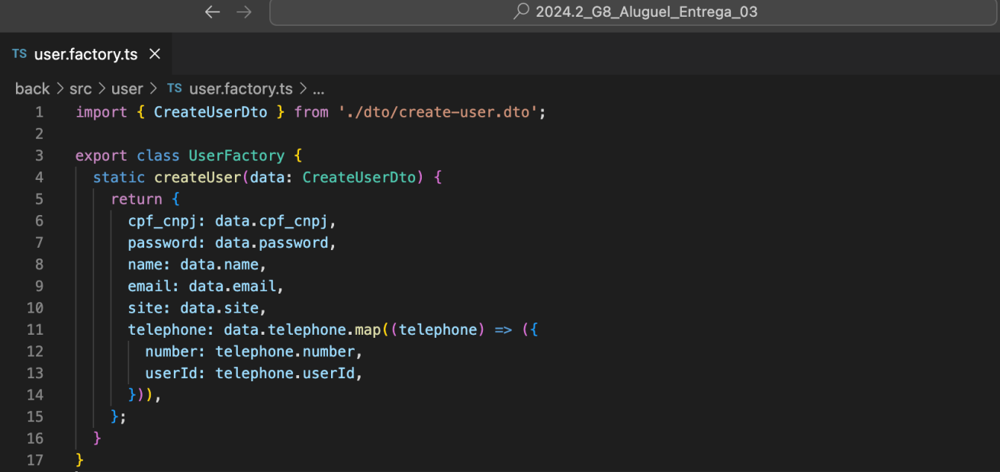

# 3.1. Módulo Padrões de Projeto GoFs Criacionais

<!-- Foco_01: Padrões de Projeto GoFs Criacionais

Entrega Mínima: 1 Padrão GoF Criacional, com nível de modelagem e nível de implementação evidenciados (ou seja, código rodando e hospedado no repositório do projeto).

Apresentação (em sala) explicando o GoF Criacional, com: (i) rastro claro aos membros participantes (MOSTRAR QUADRO DE PARTICIPAÇÕES & COMMITS); (ii) justificativas & senso crítico sobre o padrão GOF criacional, e (iii) comentários gerais sobre o trabalho em equipe. Tempo da Apresentação: +/- 5min. Recomendação: Apresentar diretamente via Wiki ou GitPages do Projeto. Baixar os conteúdos com antecedência, evitando problemas de internet no momento de exposição nas Dinâmicas de Avaliação.

A Wiki ou GitPages do Projeto deve conter um tópico dedicado ao Módulo Padrões de Projeto GoFs Criacionais, com 1 padrão GoF Criacional (modelagem & implementação), histórico de versões, referências, e demais detalhamentos gerados pela equipe nesse escopo.

Demais orientações disponíveis nas Diretrizes (vide Moodle). -->

## Factory Method

O padrão de projeto Factory Method foi utilizado para encapsular a lógica de criação de um objeto User com base nos dados recebidos no CreateUserDto. Esse padrão é útil porque centraliza a criação de objetos, promovendo reuso, padronização e organização do código.

A seguir tem a imagens da implementação:

    

<figcaption align='center'>
    <h6><b>Figura 1: Classe UserFactory. Autor(es): Gabriel Marcolino e Shaíne Oliveira</h6></b>
</figcaption>

## Referências

1. Refactoring Guru. Disponível em: <https://refactoring.guru/pt-br>. Acesso em: 24 de dezembro de 2024.

## Histórico de Versão

| Versão |    Data    |           Descrição           |                                                 Autor(es)                                                  |
| :----: | :--------: | :---------------------------: | :--------------------------------------------------------------------------------------------------------: |
| `1.0`  | 02/01/2025 | Adicionando padrão de projeto Factory | [Gabriel Marcolino](https://github.com/GabrielMR360), [Shaíne Oliveira](https://github.com/ShaineOliveira) |
