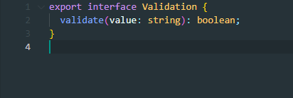
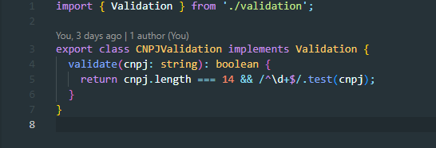
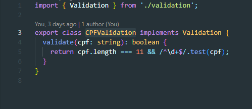
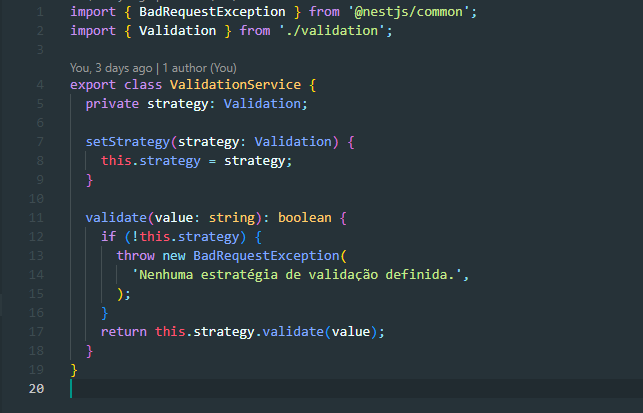

# 3.3. Módulo Padrões de Projeto GoFs Comportamentais

<!-- Foco_3: Padrões de Projeto GoFs Comportamentais.

Entrega Mínima: 1 Padrão GoF Comportamental, com nível de modelagem e nível de implementação evidenciados (ou seja, código rodando e hospedado no repositório do projeto).

Apresentação (em sala) explicando o GoF Comportamental, com: (i) rastro claro aos membros participantes (MOSTRAR QUADRO DE PARTICIPAÇÕES & COMMITS); (ii) justificativas & senso crítico sobre o padrão GOF comportamental; e (iii) comentários gerais sobre o trabalho em equipe. Tempo da Apresentação: +/- 5min. Recomendação: Apresentar diretamente via Wiki ou GitPages do Projeto. Baixar os conteúdos com antecedência, evitando problemas de internet no momento de exposição nas Dinâmicas de Avaliação.

A Wiki ou GitPages do Projeto deve conter um tópico dedicado ao Módulo Padrões de Projeto GoFs Comportamentais, com 1 padrão GoF Comportamental (modelagem & implementação), histórico de versões, referências, e demais detalhamentos gerados pela equipe nesse escopo.

Demais orientações disponíveis nas Diretrizes (vide Moodle). -->

## Strategy

### 1. Funcionalidade 1: Cadastro de Usuário

O padrão de projeto Strategy foi implementado junto da funcionalidade de **cadastro de usuário** para encapsular as diferentes validações. Assim, é possível que o comportamento de um objeto seja alterado dinamicamente, sem mudar o código que usa o objeto.

O padrão foi aplicado da seguinte forma:

* **Interface Validation:** Define o contrato comum para todas as validações.
* **Classes CNPJValidation e CPFValidation:** Implementam a interface Validation com as validações específicas para CNPJ e CPF.
* **Classe ValidationService:** Possui um atributo strategy, que armazena a estratégia de validação. A estratégia pode ser trocada dinamicamente através do método setStrategy.

A seguir tem as imagens da implementação:

<div style="text-align: center;">
    
</div>
<figcaption align='center'>
    <h6><b>Figura 1: Interface Validation. Autor(es): Gabriel Marcolino e Shaíne Oliveira</h6></b>
</figcaption>

<div style="text-align: center;">
    
</div>
<figcaption align='center'>
    <h6><b>Figura 2: Classe CNPJValidation. Autor(es): Gabriel Marcolino e Shaíne Oliveira</h6></b>
</figcaption>

<div style="text-align: center;">
    
</div>
<figcaption align='center'>
    <h6><b>Figura 3: Classe CPFValidation. Autor(es): Gabriel Marcolino e Shaíne Oliveira</h6></b>
</figcaption>

<div style="text-align: center;">
    
</div>
<figcaption align='center'>
    <h6><b>Figura 4: Classe ValidationService. Autor(es): Gabriel Marcolino e Shaíne Oliveira</h6></b>
</figcaption>

---

### 2. Funcionalidade 2: Atualização de Usuários

Nesta funcionalidade, o padrão **Strategy** foi implementado no método `updateUser`, usado para encapsular e validar os CPFs antes de atualizar os dados de um usuário no banco.

#### Fragmentos de Código

1. **Interface UpdateStrategy:**
```typescript
   export interface UpdateStrategy {
  execute(data: any): any;
}
```


2. **Classe CPFValidationStrategy:**
```typescript
export class CPFValidationStrategy implements UpdateStrategy {
  execute(cpf: string): boolean {
    if (!cpf || cpf.length !== 11) {
      throw new Error('CPF inválido');
    }
    return true;
  }
}
```


3. **Uso no Método updateUser:**
```typescript
   const validationStrategy: UpdateStrategy = new CPFValidationStrategy();
    validationStrategy.execute(cpf_cnpj);
```
---
### 3. Funcionalidade: Autenticação com Senha
Nesta funcionalidade, o padrão **Strategy** foi implementado na classe `PasswordAuthStrategy`, que encapsula a lógica de autenticação por senha. A classe permite que a estratégia de autenticação seja trocada de maneira flexível, sem modificar a estrutura principal de autenticação.
#### Fragmentos de Código
1. **Classe PasswordAuthStrategy:**
```typescript
import { Injectable } from '@nestjs/common';
import { UserRepository } from 'src/user/user.repository';
import * as bcrypt from 'bcrypt';
@Injectable()
export class PasswordAuthStrategy {
  constructor(private readonly userRepository: UserRepository) {}
  async authenticate(email: string, password: string): Promise<any> {
    const user = await this.userRepository.findByEmail(email);
    if (!user) {
      return null; 
    }

    const isPasswordValid = await bcrypt.compare(password, user.password);
    return isPasswordValid ? user : null; 
  }
}
```
2. **Uso na Classe PasswordAuth:**
```typescript
import { Injectable } from "@nestjs/common";
import { PasswordAuthStrategy } from "./strategies/password.auth.strategy";
import { TokenManager } from "./token.manager";
import { UnauthorizedException } from "@nestjs/common"; 
@Injectable()
export class PasswordAuth {
  constructor(
    private readonly strategy: PasswordAuthStrategy,
    private readonly tokenManager: TokenManager,
  ) {}
  async login(email: string, password: string): Promise<any> {
    const user = await this.strategy.authenticate(email, password);
    
    if (!user) {
      throw new UnauthorizedException('Invalid credentials'); 
    }
    
    return this.tokenManager.generateToken({ id: user.id, email: user.email });
  }
}
```

---

## Senso Crítico
### Por que Strategy?
- Permite encapsular e alternar diferentes lógicas de validação de documentos.

### Pontos Positivos:
- Extensível: Facilita a adição de novas estratégias, como CNPJ.
- Modularidade: Mantém o método principal limpo e focado.

### Limitações:
- Adiciona complexidade desnecessária em cenários simples, com apenas uma estratégia.


## Template

### 1. Funcionalidade 1: Detalhar propriedade

O padrão **Template** foi aplicado para adicionar praticidade à busca de propriedades.

## Rastreabilidade e Elos com Outros Artefatos

- **FindProperty**: É o Template. Implementa o método imutável e declara os métodos abstratos de validação da entrada e formatação da saída.
- **FindOneProperty**: Extende FindProperty e implementa os métodos abstratos da classe mãe. 
- **PropertyService**: Utiliza o FindOneProperty para fazer a busca de imóveis.

## Implementação
### Classe FindProperty:

```typescript
export abstract class FindProperty<I, O> {
  async getObject(data: I): Promise<O> {
    this.validateObject(data);

    const property = await this.fetchObject(data);

    return this.formatResponse(property);
  }

  protected abstract validateObject(data: I): void;

  protected abstract fetchObject(data: I): Promise<Property | Property[]>;

  protected abstract formatResponse(property: Property | Property[]): O;
}

```


### Classe FindOneProperty:

```typescript
export class FindOneProperty extends FindProperty<number, PropertyDetailsDto> {
  constructor(private readonly repository: PropertyRepository) {
    super();
  }

  protected validateObject(id: number): void {
    if (!id || id < 1) {
      throw new Error('ID is required and must be valid.');
    }
  }

  protected async fetchObject(id: number): Promise<Property> {
    return this.repository.findPropertyById(id);
  }

  protected formatResponse(property: Property): PropertyDetailsDto {
    return {
      ...property,
    };
  }
}
```

### Uso no método findOne da classe PropertyService:

```typescript
  async findOne(id: number) {
    const finder = new FindOneProperty(this.repository);
    return finder.getObject(id);
    }
```

## Senso Crítico
### Por que Template?

- Define etapas padrões para todas as buscas de propriedades. 

### Pontos Positivos:

- Padroniza a estrutura do código, reduzindo possíveis erros.
- Torna o código principal mais limpo e conciso.
- É flexível, permite que um método específico seja sobrescrito de acordo com a necessidade.

### Limitações:

- Não permite que os métodos já implementados no template sejam alterados.
- Rígido para alterações futuras


## Referências

1. Refactoring Guru. Disponível em: <https://refactoring.guru/pt-br>. Ultimo acesso em: 3 de janeiro de 2025.
2. Wikipedia. Disponível em: <https://pt.wikipedia.org/wiki/Template_Method>. Ultimo acesso em: 6 de janeiro de 2025.

## Histórico de Versão

| Versão |    Data    |           Descrição           |                                                 Autor(es)                                                  |
| :----: | :--------: | :---------------------------: | :--------------------------------------------------------------------------------------------------------: |
| `1.0`  | 02/01/2025 | Adicionando padrão de projeto Strategy (Funcionalidade 1) | [Gabriel Marcolino](https://github.com/GabrielMR360), [Shaíne Oliveira](https://github.com/ShaineOliveira) |
| `2.0`  | 04/01/2025 | Implementação e documentação da estratégia CPFValidation (Funcionalidade 2) | [Arthur Gabriel](https://github.com/ArthurGabrieel), [Miguel Moreira](https://github.com/EhOMiguel) |
| `3.0`  | 06/01/2025 | Implementação e documentação do padrão de projeto Template | [Pedro Sena](https://github.com/pedroyen21) |
| `4.0`  | 06/01/2025 | Implementação e documentação da estratégia de autenticação com senha (Funcionalidade 3 - Padrão Strategy) | [Pedro Izarias](https://github.com/Izarias), [Gabriel Bertolazi](https://github.com/Bertolazi) |
