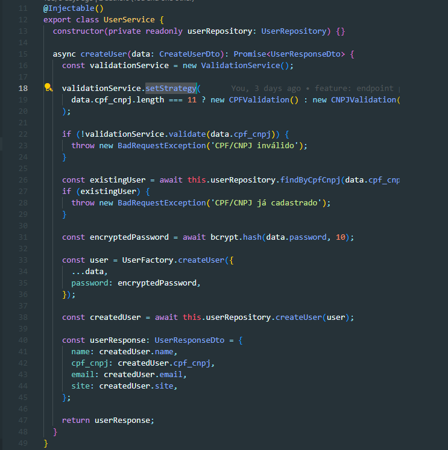

# 3.3. Módulo Padrões de Projeto GoFs Comportamentais

<!-- Foco_3: Padrões de Projeto GoFs Comportamentais.

Entrega Mínima: 1 Padrão GoF Comportamental, com nível de modelagem e nível de implementação evidenciados (ou seja, código rodando e hospedado no repositório do projeto).

Apresentação (em sala) explicando o GoF Comportamental, com: (i) rastro claro aos membros participantes (MOSTRAR QUADRO DE PARTICIPAÇÕES & COMMITS); (ii) justificativas & senso crítico sobre o padrão GOF comportamental; e (iii) comentários gerais sobre o trabalho em equipe. Tempo da Apresentação: +/- 5min. Recomendação: Apresentar diretamente via Wiki ou GitPages do Projeto. Baixar os conteúdos com antecedência, evitando problemas de internet no momento de exposição nas Dinâmicas de Avaliação.

A Wiki ou GitPages do Projeto deve conter um tópico dedicado ao Módulo Padrões de Projeto GoFs Comportamentais, com 1 padrão GoF Comportamental (modelagem & implementação), histórico de versões, referências, e demais detalhamentos gerados pela equipe nesse escopo.

Demais orientações disponíveis nas Diretrizes (vide Moodle). -->

## Strategy

O padrão de projeto Strategy foi implementado junto da funcionalidade de cadastro de usuário para encapsular as diferentes validações, assim é possível que o comportamento de um objeto seja alterado dinamicamente, sem mudar o código que usa o objeto.

O padrão foi aplicado da seguinte forma:

* Interface Validation: Define o contrato comum para todas as validações.
* Classes CNPJValidation e CPFValidation: Implementam a interface Validation com as validações específicas para CNPJ e CPF.
* Classe ValidationService: Possui um atributo strategy, que armazena a estratégia de validação. A estratégia pode ser trocada dinamicamente através do método setStrategy.

A seguir tem as imagens da implementação:

    

<figcaption align='center'>
    <h6><b>Figura 1: Interface Validation. Autor(es): Gabriel Marcolino e Shaíne Oliveira</h6></b>
</figcaption>

    

<figcaption align='center'>
    <h6><b>Figura 2: Classe CNPJValidation. Autor(es): Gabriel Marcolino e Shaíne Oliveira</h6></b>
</figcaption>

    

<figcaption align='center'>
    <h6><b>Figura 3: Classe CPFValidation. Autor(es): Gabriel Marcolino e Shaíne Oliveira</h6></b>
</figcaption>

    

<figcaption align='center'>
    <h6><b>Figura 4: Classe ValidationService. Autor(es): Gabriel Marcolino e Shaíne Oliveira</h6></b>
</figcaption>

    

<figcaption align='center'>
    <h6><b>Figura 5: Classe ValidationService. Autor(es): Gabriel Marcolino e Shaíne Oliveira</h6></b>
</figcaption>

## Referências

1. Refactoring Guru. Disponível em: <https://refactoring.guru/pt-br>. Acesso em: 24 de dezembro de 2024.

## Histórico de Versão

| Versão |    Data    |           Descrição           |                                                 Autor(es)                                                  |
| :----: | :--------: | :---------------------------: | :--------------------------------------------------------------------------------------------------------: |
| `1.0`  | 02/01/2025 | Adicionando padrão de projeto Strategy | [Gabriel Marcolino](https://github.com/GabrielMR360), [Shaíne Oliveira](https://github.com/ShaineOliveira) |
